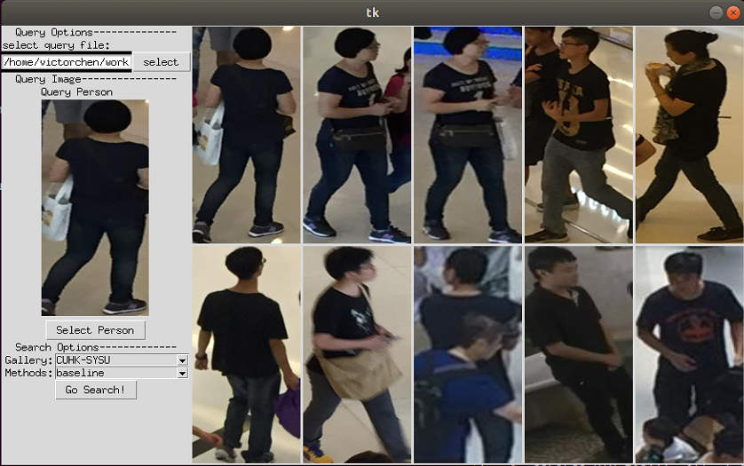

# Person Search Research

This codebase is a framework of person search research and provides serveral strong person search models with simple design.

This codebase contains some thoughts about contextual information in one of our previous unpublished paper and [ACAE paper](https://arxiv.org/abs/2111.14316).

## project overview

```plain
./
├── bin                            : runnable scripts
├── configs                        : config files
├── data                           : folder containing dataset
├── datasets                       : dataset loading module
├── demo                           : GUI program related module
├── doc                            : description files
├── evaluation                     : evaluation and visulization related moduel
├── exps                           : experiment directory, saving training/testing records
├── models                         : models related module
├── utils                          : utility module
├── environments.yml
├── requirements.txt
├── README.md
├── README-zh.md
└── search.sh
```

## train

1. **setup dataset**: put CUHK-SYSU and PRW under folder `data/` and ensure the paths are `data/cuhk-sysu` and `data/prw` seperately.

```bash
mkdir data
sudo ln -s <cuhk-sysu-target-folder> data/cuhk-sysu
sudo ln -s <prw-target-folder> data/prw
```

2. **train:** we provide different trainer for different circumstances, but each trainer accepts only one argument `--cfg` to specify the path of target config file.

```bash
# for common tranining without graph modules
python -m models.trainer --cfg <cfg-path>
# for training RetinaNet or FCOS based model without graph modules
python -m models.iter_trainer --cfg <cfg-path>
# for training with ACAE
python -m models.graph_trainer --cfg <cfg-path> 
# for training with ACAE but freeze the person search model
python -m models.freeze_trainer --cfg <cfg-path>
```

__check `bin/train.sh` for more details and examples.__

## test

This codebase provides three ways to evaluate the performance of person search models.

- **Common way.**
- **CMM way:** an re-ranking like evaluation method, which could be adapted on all person search models if providing the features of query and gallery.
- **ACAE way:** another re-ranking like evaluation method, however only for models with trained ACAE module.

CMM way and ACAE way both take co-walkers information into consideration and in most circumstances, they could improve the baseline person search performance without much modification.

To evaluate, run the following commands, where `<exps_dir>` is the saved folder, and `<eval-config-path>` is the path of an evaluation config file.

If `<eval-config-path>` is not specified, the priority of evaluation file is: `eval.yml` > `config.yml` under `<exps_dir>`.

```bash
# common way and cmm way
python -m evaluation.eval_defaults <exps_dir> --eval-config <eval-config-path>
# acae way
python -m evaluation.eval_graph <exps_dir> --eval-config <eval-config-path>
```

__check `bin/eval.test.sh` for more details and examples.__

## demo

This codebase also includes a simple person search system under `demo/` with a concise GUI dashboard implemented by Tkinter.



To run the demo:

1. download the pretrained models and serialized pickles which store the extracted detected boxes and persons' features of CUHK-SYSU.

2. go to the `choose_model_dataset` function in `demo/search_tools.py` to specify the base roots of checkpoint in `exp_dir` and the paths of serialized pickle in `pkl_path` of different search options.

3. run the demo with

```bash
python -m demo.main
```

4. Basic usage of the GUI program: (1) Click the `select` button to select input image file; (2) Click the `Select Person` button to draw the bounding box of target query person (Once decided, close the prompt drawing window); (3) Choose search options and go search !

More about the demo:

- Currently, this gui program runs well in Ubuntu18.04, but is **not** tested on Windows. There might be differences between the two OS about events binding in Tkinter.
- Feel free to change the options of searching in the gui program.

## pretrained model

- All pretrained models are based on ResNet-50 backbone.
- Each experimental directory contains the following files: checkpoint, `config.yml`, `eval.yml`(only for evaluation), `eval.txt` and `eval.pkl` (containing pre-extracted features for GUI program).
- Results are all trained on one Nvidia RTX2080Ti.

| name | detection-baseline | dataset | det-ap | det-recall | reid-mAP | reid-top-1 | exp_dir |
| -- | -- | -- | -- | -- | -- | -- | -- |
| baseline | Faster-RCNN | CUHK-SYSU | 87.29 | 89.83 | 92.36 | 93.24 | `exps/exps_cuhk` |
| baseline | Faster-RCNN | PRW | 91.85 | 93.94 | 44.49 | 82.74 | `exps/exps_prw` |
| baseline | FPN | CUHK-SYSU | 89.10 | 92.85 | 84.41 | 84.79 | `exps/exps_det/exps_cuhk.fpn.layer1` |
| baseline | RetinaNet | CUHK-SYSU | 87.88 | 95.91 | 86.54 | 87.90 | `exps/exps_det/exps_cuhk.retinanet.loss_weights.iter.new_head.large2048` |
| baseline | FCOS | CUHK-SYSU | 75.55 | 90.00 | 81.25 | 82.26 | `exps/exps_det/exps_cuhk.fcos.loss_cls_5.center.iter` |
| ACAE | Faster-RCNN | CUHK-SYSU | 87.49 | 90.22 | 93.64 | 94.38 | `exps/exps_acae/exps_cuhk.closs_35` |
| ACAE | Faster-RCNN | PRW | 91.96 | 94.12 | 45.25 | 86.53 | `exps/exps_acae/exps_prw.closs_60` |

Shared link:

- [Baidu Yun: https://pan.baidu.com/s/1Pchl7cnNLgMWjYQrmNagbw](https://pan.baidu.com/s/1Pchl7cnNLgMWjYQrmNagbw), password: o3m5

Moreover:

- Baseline models on FPN/FCOS/RetinaNet are experimental, so the overall search performance are not finetuned to the best, but they are easy to use and feasible in ablation study.

## TODO/Update

- [ ] Bugs in moving/resize view of pictures in the GUI program.
- [x] Optimize the dashboard of the GUI program, especially removing unrelated inplace images and adding more description.

## Reference

This codebase is inspired by the following awesome person search codebases:

- [NAE: https://github.com/dichen-cd/NAE4PS](https://github.com/dichen-cd/NAE4PS)
- [SeqNet: https://github.com/serend1p1ty/SeqNet](https://github.com/serend1p1ty/SeqNet)
